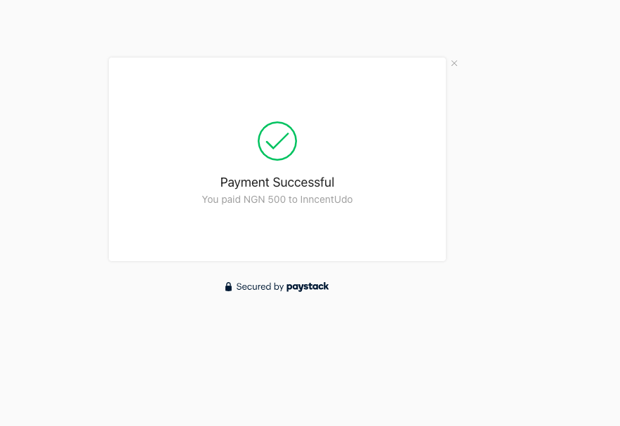
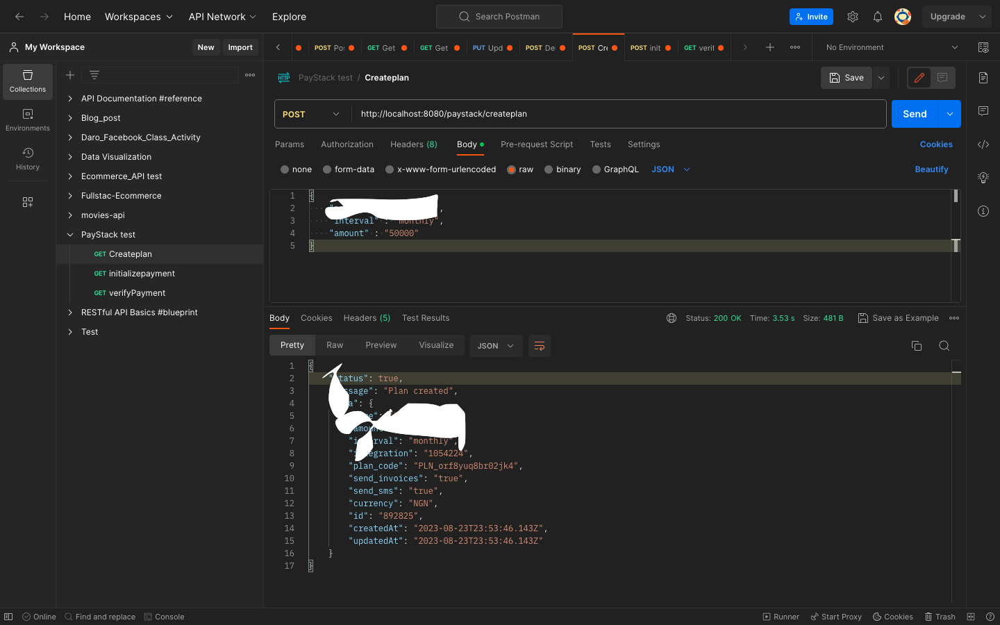
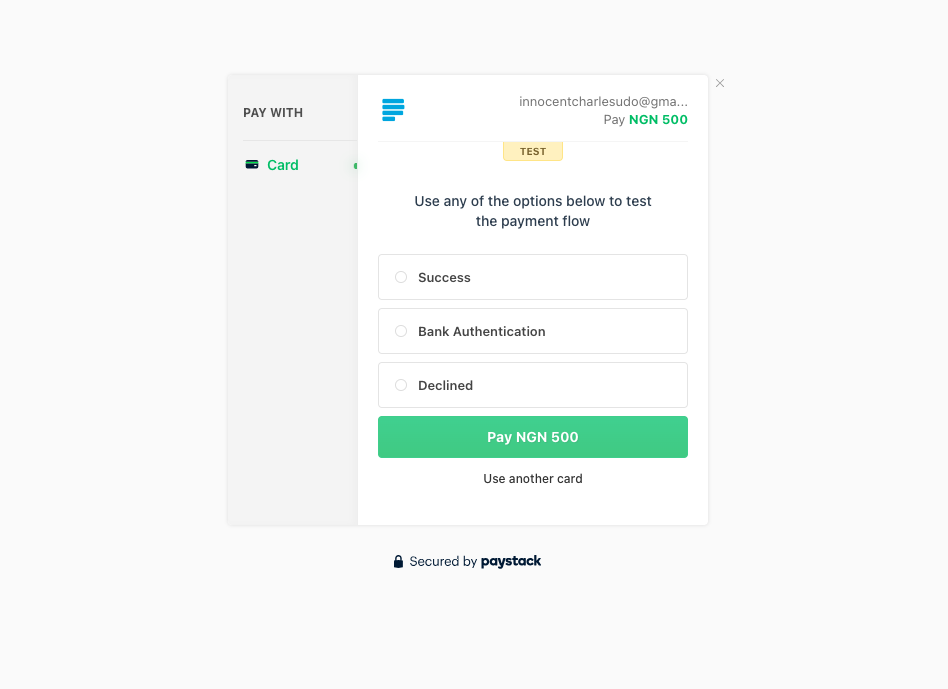
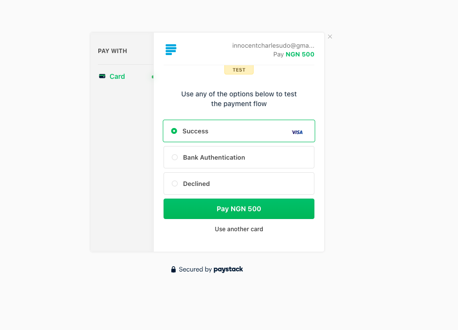

# PayStack Integration API

## GUIDE
+ [Implemmentation Guide](https://medium.com/@yahayayusuf/integrate-paystack-payment-gateway-using-spring-boot-81b202bbe70a)

### ___View___

`Integrating the Paystack payment gateway with a Spring Boot application involves a few steps. 
Paystack provides APIs that you can use to interact with their payment system. 
Here's a general outline of how you can integrate Paystack into your Spring Boot application:`

### Prerequisites
+ Basic Spring boot.
+ Basic of Rest API.
+ Basic of Java

Simply create an account on the [Paystack website](https://paystack.com/).

### ___PostMan view___

### Setup a Spring Boot application with the following dependencies
+ Spring Web.
+ Spring Data JPA.
+ MySQL Driver.
+ Lombok
+ HTTPClient.
+ Hibernate Validation dependency.
+ Lombok.

## Sign Up and Get API Keys:
Start by signing up on the Paystack platform to get your API keys. 
You'll need both the test and live API keys for development and production environments respectively.

## Create Payment Request Endpoint:
Create a REST endpoint in your Spring Boot application to initiate a payment request. 
This endpoint will generate a payment URL and return it to the client.

### ___DTO view___

## Handle Webhooks:
Paystack sends webhook events to your application to notify about payment status changes. 
Implement endpoints to handle these webhook events and update your application accordingly.

## Implement Paystack API Calls:
Use HTTP client libraries (like RestTemplate or WebClient) in Spring Boot to make requests to Paystack's APIs. 
You'll use these calls to create transactions, verify payments, and handle other payment-related tasks.

### ___JPA Buddy___

<!-- CONTACT -->
## Author
- [ ] SUNDAY PETER

- [ ] [@linkedin](https://www.linkedin.com/in/sundaypeter1/)

- [ ] sundaypetersp12@gmail.com

- [ ] WhatsApp : 08186707807

- [ ] CALL : 08169036052

